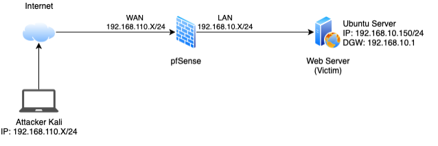
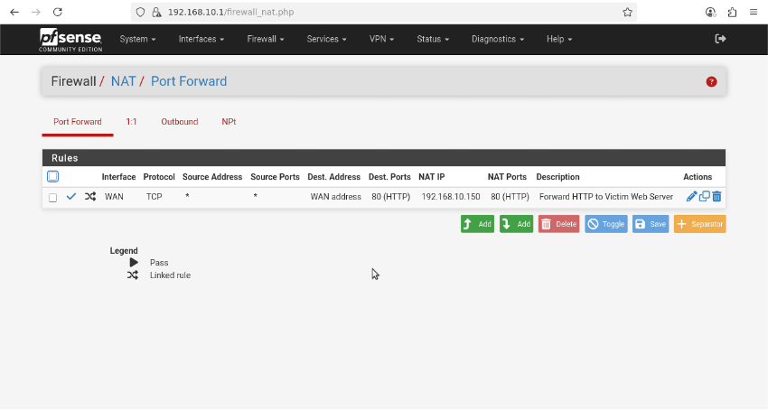
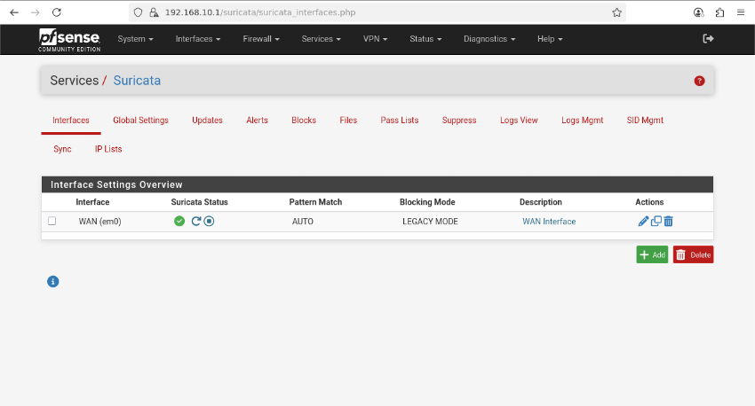
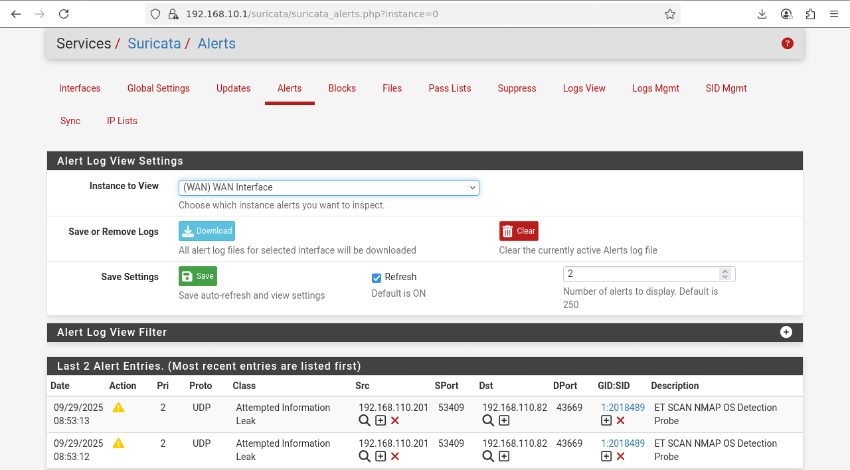
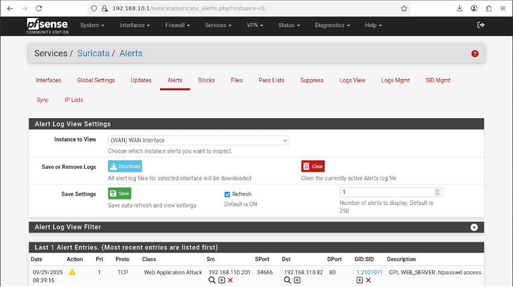
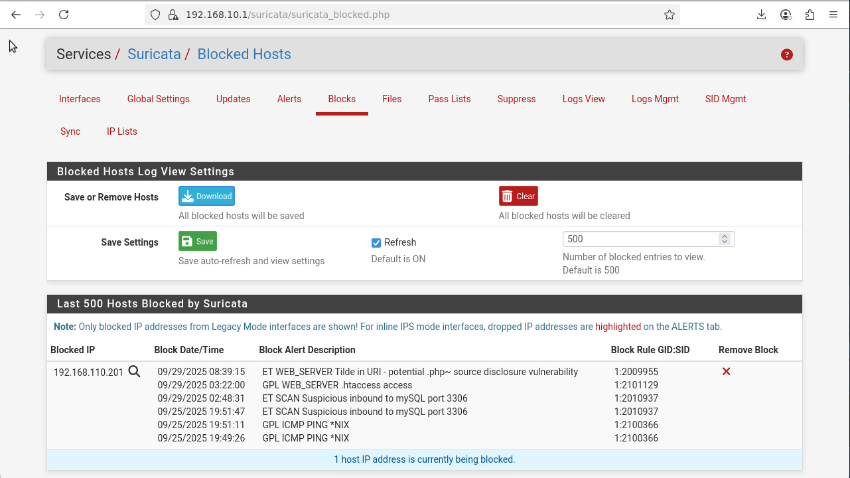

<p align="center">
  
  
  
  
</p>

# Enterprise-Grade Intrusion Detection & Prevention System (IDS/IPS) Lab

## 1. Project Overview & Context

In modern network security, a traditional stateless firewall is no longer sufficient. It acts like a security guard who only checks IDs (IP addresses and ports) but doesn't inspect the contents of the bags being carried through. This leaves the network vulnerable to sophisticated attacks hidden within legitimate-looking traffic.

This project addresses that gap by building a practical, hands-on lab that demonstrates how to deploy **Suricata**, a high-performance, open-source Intrusion Detection and Prevention System (IDS/IPS), on a **pfSense firewall**. The goal is to transform the firewall from a simple packet filter into an intelligent, proactive threat management gateway capable of performing deep packet inspection and neutralizing threats in real-time.

---

## 2. Key Objectives & Skills Demonstrated

-   **Network Segmentation:** Designing and deploying a multi-layered virtual network with isolated WAN and protected LAN zones.
-   **IDS/IPS Integration:** Installing, configuring, and fine-tuning Suricata in Intrusion Prevention (IPS) mode to actively block threats.
-   **Threat Simulation:** Replicating common real-world attack vectors, including network reconnaissance (Nmap) and web vulnerability scanning (Nikto).
-   **Real-Time Detection & Prevention:** Validating the system's ability to identify malicious patterns and automatically block the attacker's source IP.
-   **Forensic Analysis:** Demonstrating the ability to analyze application-layer logs (HTTP, TLS) generated by Suricata to understand attack methods.

---

## 3. Lab Architecture & Technology Stack

The entire environment was virtualized using UTM on an Apple Silicon Mac, emulating an x86_64 architecture for broad compatibility.


_**Figure 1:** The lab's network topology, featuring an attacker, a firewall/IPS, and a victim server._

### Technology Stack

| Component                  | Technology Used        | Purpose in this Lab                                            |
| -------------------------- | ---------------------- | -------------------------------------------------------------- |
| **Firewall & Gateway**     | pfSense CE             | Manages routing, NAT, and serves as the host for Suricata.     |
| **IDS/IPS Engine**         | Suricata               | Performs deep packet inspection and enforces blocking rules.   |
| **Virtualization Platform**| UTM                    | Hosts and manages all virtual machines and network interfaces. |
| **Victim Server**          | Ubuntu Server          | A standard web server, representing a critical internal asset. |
| **Attacker Machine**       | Kali Linux             | The source of simulated attacks, equipped with pentesting tools. |
| **Attack Tools**           | Nmap, Nikto            | Used for network discovery and web vulnerability scanning.     |

---

## 4. Step-by-Step Implementation

### Phase 1: pfSense Firewall Configuration
The foundation of the lab is a correctly configured firewall.
1.  **Interface Setup:** Two interfaces were configured:
    -   `WAN`: Bridged to the host machine's network to simulate public internet access.
    -   `LAN`: A private, host-only network (`192.168.10.0/24`) to isolate the victim server.
2.  **NAT Port Forwarding:** To allow external attack traffic to reach the internal web server, a Port Forwarding rule was created. This rule forwards all incoming TCP traffic on port 80 (HTTP) on the WAN interface to the Ubuntu Victim server at `192.168.10.150`.


_**Figure 2:** The NAT rule enabling external access to the internal web server._

### Phase 2: Suricata Integration as an IPS
This phase transformed the firewall into an active defense system.
1.  **Installation:** Suricata was installed directly via the pfSense Package Manager.
2.  **IPS Mode Activation:** Suricata was configured to operate in **Inline IPS Mode** on the `WAN` interface. This is a critical step: in this mode, Suricata inspects traffic *before* it's processed by the firewall rules, allowing it to drop malicious packets before they can go any further.
3.  **Enabling "Block Offenders":** This powerful feature was enabled to automatically add the source IP address of any host that triggers an alert to the firewall's block list, effectively blacklisting the attacker in real-time.


_**Figure 3:** Suricata configured in Inline IPS mode on the WAN interface._

---

## 5. Attack Simulation & Validation

To prove the system's effectiveness, two common attack scenarios were executed from the Kali Linux machine.

### Test Case 1: Nmap Reconnaissance Scan

-   **Objective:** To simulate an attacker's initial discovery phase, scanning for open ports and services.
-   **Command Executed:**
    ```bash
    # Perform an aggressive scan to detect OS, services, and run default scripts
    nmap -A <Firewall_Public_IP>
    ```
-   **Detection & Analysis:** Almost immediately, Suricata's ruleset identified the aggressive scanning patterns. The alert logs filled with multiple high-priority events related to "ET SCAN Nmap Scripting Engine User-Agent" and various port scan detections.


_**Figure 4:** Suricata alerts generated by the Nmap scan._

### Test Case 2: Nikto Web Vulnerability Scan

-   **Objective:** To simulate an application-layer attack targeting the web server to find common vulnerabilities.
-   **Command Executed:**
    ```bash
    # Scan the web server on port 80 for known vulnerabilities
    nikto -h <Firewall_Public_IP>
    ```
-   **Detection & Analysis:** Suricata's application-layer rules immediately detected signatures specific to Nikto's behavior, such as attempts to access common administrative paths (`/wp-admin/`), potential Directory Traversal attacks (`../`), and other suspicious HTTP requests.


_**Figure 5:** Web attack alerts generated by the Nikto vulnerability scan._

---

## 6. Core Result: Automatic Threat Neutralization

**This is the ultimate goal of an IPS.** As a direct result of the high-priority alerts generated by both the Nmap and Nikto scans, the **"Block Offenders"** feature worked exactly as designed.

Suricata automatically added the attacker's IP address (`192.168.110.201`) to its block list. This action instantly prevented the attacker from sending *any* further traffic to the network, effectively neutralizing the threat in real-time. Any subsequent connection attempts from the Kali machine, including a simple ping, would time out.


_**Figure 6:** The attacker's IP is automatically added to the block list, proving the system's preventative capability._

---

## 7. Project Significance & Key Learnings

This project was more than a theoretical exercise; it was a microcosm of real-world security operations.

-   **Real-World Application:** The skills used here are directly applicable to securing corporate networks, meeting compliance requirements (e.g., PCI-DSS, HIPAA) by monitoring traffic, and providing a crucial layer of perimeter defense.
-   **Practical Experience:** I gained hands-on experience in deploying and managing a critical network defense tool, moving beyond theory to practical application.
-   **Incident Response Insight:** Analyzing the logs provided invaluable insight into how to identify attack vectors, understand the scope of a potential compromise, and gather forensic data.
-   **Defense-in-Depth:** This lab solidified my understanding of the "defense-in-depth" security model, where an IDS/IPS acts as an essential, intelligent layer alongside traditional firewalls.
